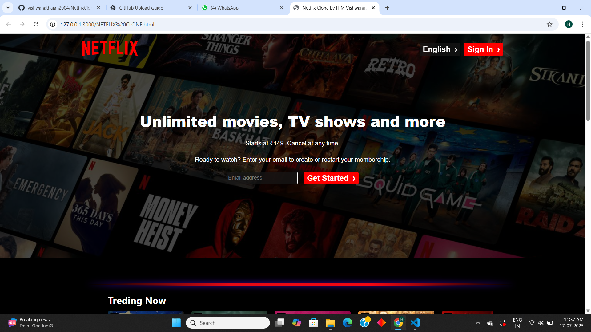
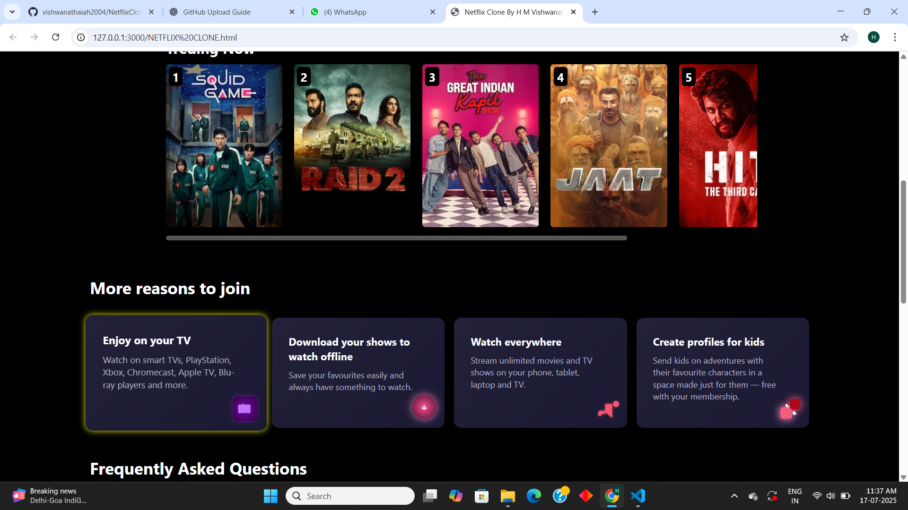
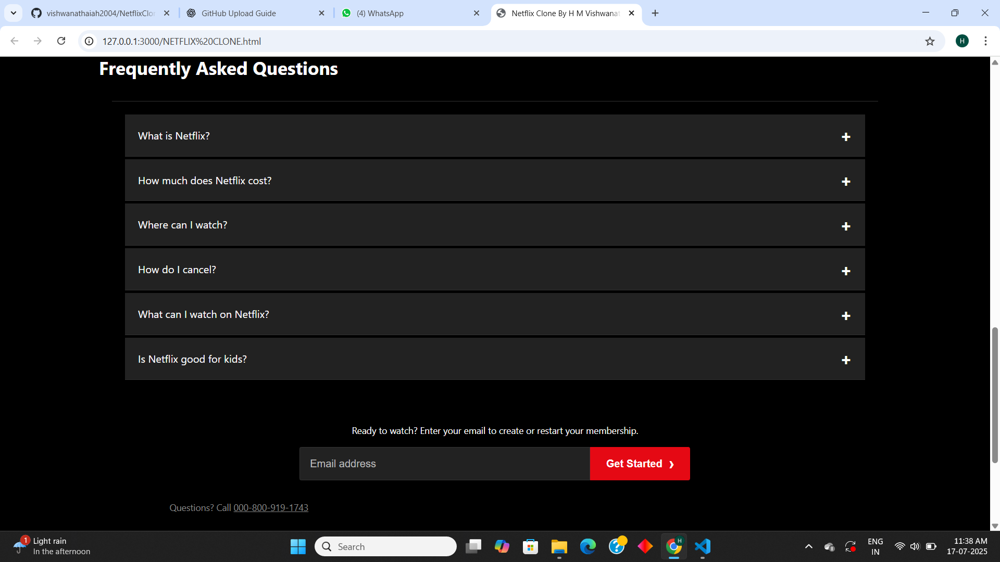
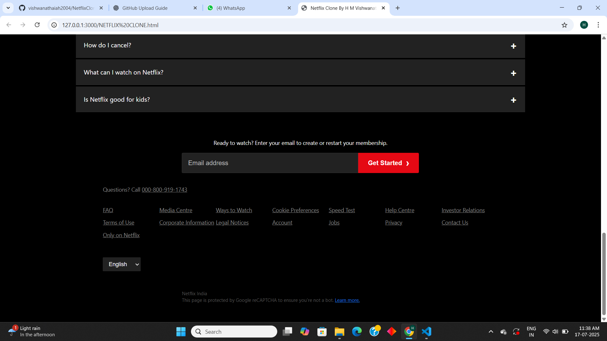

# 🎬 Netflix Clone – HTML & CSS

A simple clone of the Netflix homepage built entirely with **HTML and CSS**.  
This project is a frontend practice to replicate the layout and visual style of Netflix's landing page.

## 🚀 Features

- Fully responsive layout (if styled accordingly)
- Clean and semantic HTML structure
- Styled using modern CSS techniques (Flexbox, Grid, etc.)
- Includes:
  - Navigation bar
  - Hero section with background image
  - Featured movies/thumbnails section
  - Footer

## 📁 Folder Structure
netflix-clone/
├── assets/
│ └── images/
├── NETFLIX CLONE.html
├── style.css
└── README.md

## 📸 Screenshots

